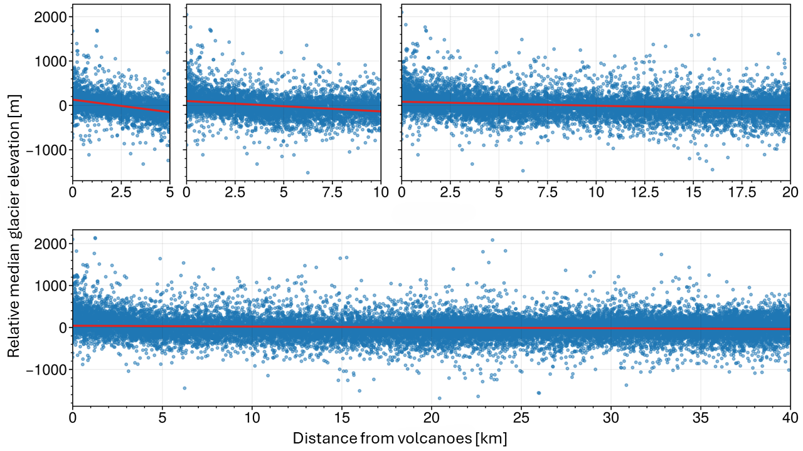
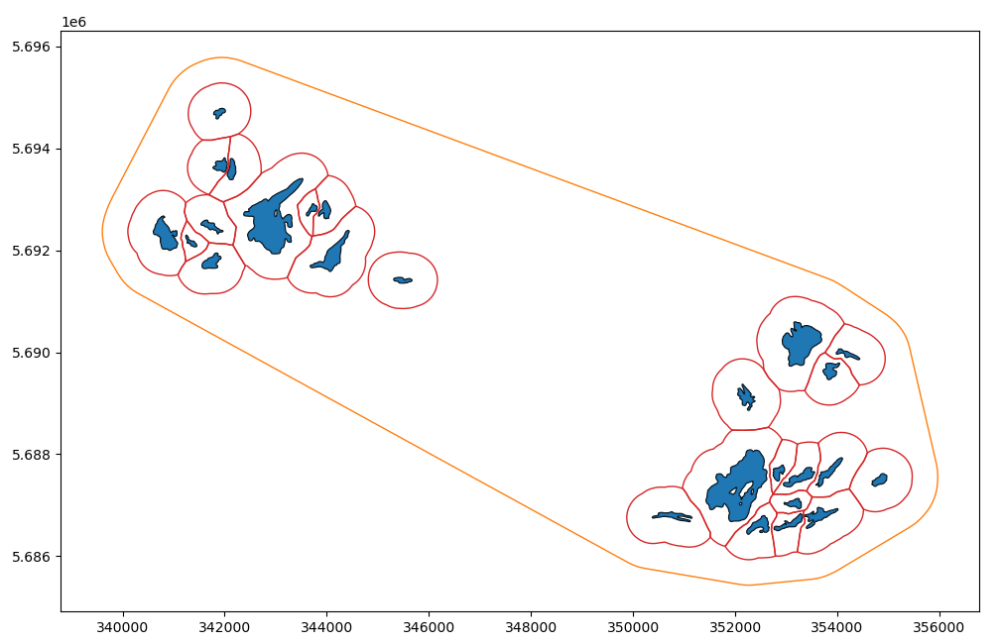

# Glaciers by volcanoes - `glac_by_volc`

Repository for code\* used to locate glaciers within a radial distance from volcanoes, and perform analysis on the geometries and dynamics of those glaciers. 

> \*The code will be made available upon publication of results.

## Volcanic controls on glacier elevation - Abstract (IGS British Branch poster)

Glaciated volcanoes pose heightened risk to societies compared to their ice-free counterparts. Monitoring of glaciovolcanic processes is therefore of vital importance, as traditional surveys of volcanic activity may be hindered by glacier cover and/or remoteness. Volcanic activity has the potential of asserting controls on the dynamics and mass balance of nearby glaciers. Previous studies have shown that overlying glaciers of some volcanoes are bound to higher elevations than other neighbouring glaciers. Here we analyse global datasets of volcanoes and glacier geometries to delineate local trends in glacier elevation, and  assess the effect of volcanism. Additionally, we utilise multispectral and synthetic aperture radar images from the Sentinel satellites to automatically track glacier elevation changes. We demonstrate that, globally, volcanoes modulate the elevation of overlying glaciers, irrespective of local topography and climate. We further present some initial results from our automated annual tracking of glacier elevations, showing diverging trends between glaciers proximal and distal to volcanoes.

## Methods

### Locating glaciers by volcanoes

We locate glaciers within the vicinity of volcanoes by comparing two databases: The ``Volcanoes of the World'' of the [Smithsonian Global Volcanism Program (GVP)](https://volcano.si.edu/volcanolist_holocene.cfm) -- a complete list of Earth's Holocene volcanoes; and the [Randolph Glacier Inventory (RGI) version 7.0](http://www.glims.org/rgi_user_guide/welcome.html) -- a dataset containing outlines and information for all glaciers in the World, excluding the ice sheets of Greenland and Antarctica, in the year 2000. We locate all RGI glacier geometries within a radial search area around each GVP volcano with Python scripts utilising the geospatial data package [GeoPandas](https://geopandas.org/). The code effectively accomplishes the same as that of [Edwards et al. (2020)](https://doi.org/10.1016/j.gloplacha.2020.103356) who used a search radius of 5 km, but does so automatically and allows the user to specify the search radius. In this study we use 5, 10, 20, and 40 km search radii. Besides downloading this repository and the data (see [Data](#data)), the code is fully automated, with optional user inputs.

### Relative glacier elevations

Though we intend to look at glaciers on a global scale, it is necessary to look at each individual glacier within a local context to discern any anomalies or trends. [Howcutt et al. (2023)](https://doi.org/10.1130/G51411.1) looked at the elevation of glaciers surrounding several volcanoes in South America. They used the deviance of the mean ELA of glaciers on a volcano, $\bar{z}\_{\rm ELA}^{\rm volcanic}$, compared to the mean ELA of nearby glaciers, $\bar{z}\_{\rm ELA}^{\rm proximal}$, as

$$\Delta \bar{z}\_{\rm ELA} = \bar{z}\_{\rm ELA}^{\rm volcanic} - \bar{z}\_{\rm ELA}^{\rm proximal}.$$

We adopt the methodology of [Howcutt et al. (2023)](https://doi.org/10.1130/G51411.1), but adapt it to use the median glacier elevations, $\tilde{z}$, instead of ELAs. We compute the relative median elevation for each ($i$-th) individual glacier wtihin the locality, given by the search radius, of a volcano as

$$\Delta \tilde{z}\_{i} = \tilde{z}\_{i} - \overline{\tilde{{z}}},$$

where 

$$\overline{\tilde{z}} = \frac{1}{n} \sum_{i=1}^{n} \tilde{z}\_i$$

is the average median glacier elevation within the region, comprising of $n$ glaciers.

### Multiple linear regression

To identify parameter relations, we use multiple linear regression (**Fig. 1**)

$$y_i = \beta_0 + \sum_{j=1}^{n} \beta_j x_{ij},$$

where $y_i$ are the target variables, $x_{ij}$ are the explanatory variables, and $\beta_j$ are regression coefficients. We use two Python libraries, [SciPy](https://scipy.org/) and [statsmodels](https://www.statsmodels.org), to carry out the linear regression to ensure consistent results.

|  |
|--|
| **Fig. 1.** *Example of fitting the relative median elevation of glaciers to the distance from volcanoes.* |

### Timeseries of glacier area

The code extracts glacier area from both synthetic aperature radar (SAR) and multispectral/optical images from Sentinel 1 and 2, respectively [(Barella et al., 2022)](https://doi.org/10.1109/JSTARS.2022.3179050). The SAR scenes are processed into InSAR pairs, and glacier geometries are extracted by applying a threshold to the coherence maps between pairs. The optical scenes are stitched into cloud- and snow-free mosaics, and snow and ice pixels in the mosaic are extracted by: (i) applying a threshold to the [normalized difference snow index (NDSI)](https://custom-scripts.sentinel-hub.com/sentinel-2/ndsi/) that is computed from the sensor's bands, and (ii) a combinations of band thresholds according to the [Level-2A Algorithm](https://sentinels.copernicus.eu/web/sentinel/technical-guides/sentinel-2-msi/level-2a/algorithm-overview). We use the facilities made available by [Alaska Satellite Facility (ASF)](https://asf.alaska.edu/) to produce InSAR products from Sentinel 1 scenes of an area of interest, and [Google Earth Engine (GEE)](https://earthengine.google.com/) to produce cloud free mosaics from Sentinel 2 scenes of an area of interest. The code then identifies glaciated pixels within buffered RGI glacier geometries (**Fig. 2**) and attributes those to each respective glacier.

|  |
|--|
| **Fig. 2.** *Examples of buffered (red) RGI glacier geometries (blue), along with a buffered convex hull geometry (yellow) used for data reductions.* |

## Preliminary results

Please see the poster presented at IGS British Branch meeting 2024.
